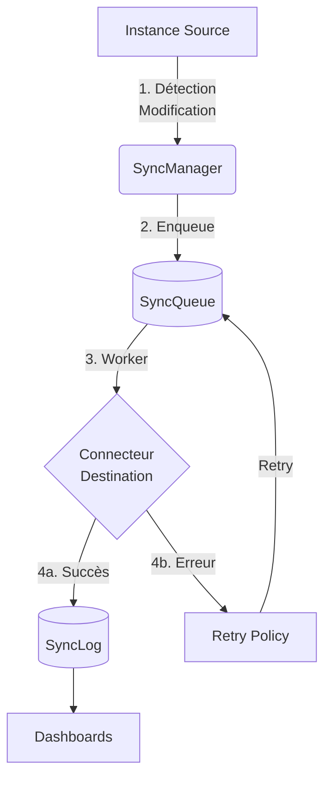
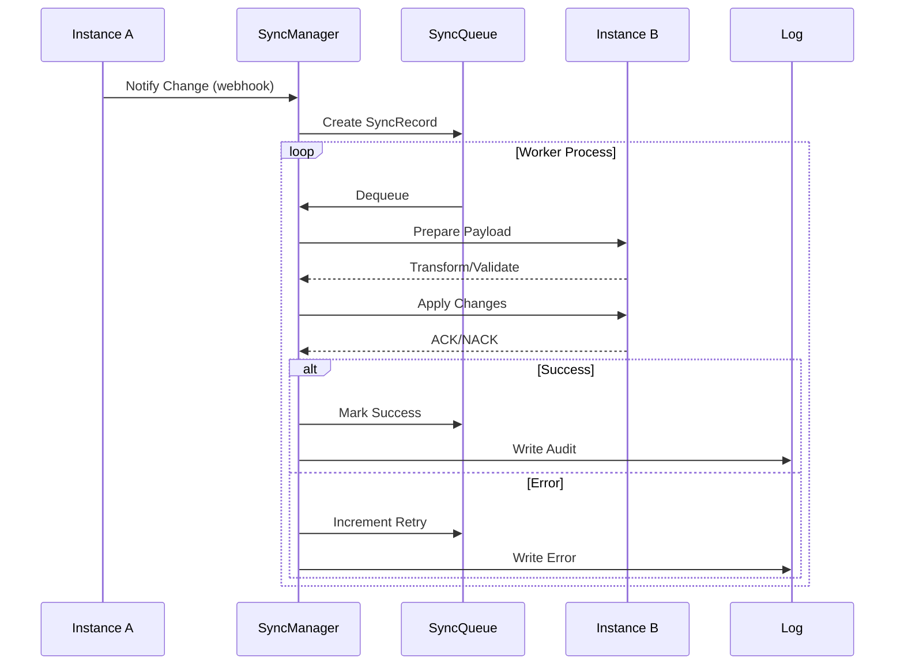

# Module de Synchronisation Odoo-to-Odoo

## Objectif
Ce module permet la synchronisation bidirectionnelle de données entre deux instances Odoo via XML-RPC, avec un système de validation et de reprise robuste.

## Potential Issues and Fragile Areas
**Broad Exception Handling**: Plusieurs fichiers utilisent des clauses `except Exception` trop larges qui pourraient masquer des problèmes sous-jacents :

- `sync_instance.py` a une gestion d'exception large avec un commentaire de désactivation pylint
- `sync_manager.py` a plusieurs gestionnaires d'exception larges
- `sync_observer.py` a des gestionnaires d'exception larges

**Missing Validation**: La logique de validation précédemment manquante pour la transformation des payloads dans `sync_manager.py` a été implémentée.

## Architecture

### Flux Global


### Séquence de Synchronisation


## Caractéristiques Principales

### 1. Architecture Multi-Instances et Asynchrone
- Support de connexions multiples vers différentes instances Odoo
- Insertion automatique dans la queue via surcharge des méthodes create/write/unlink
- Traitement en arrière-plan des synchronisations via un worker dédié
- Possibilité de synchronisation immédiate pour les cas critiques

### 2. Configuration
- Mapping des champs configurable par modèle, par relation odoo-odoo
- Gestion automatique des dépendances entre modèles
- Paramètres de connexion sécurisés pour chaque instance

### 3. Mécanismes de Validation
- Validation des données avant synchronisation
- Vérification de l'intégrité des données
- Gestion des conflits de synchronisation
- Journalisation détaillée des opérations

### 4. Système de Reprise
- Détection automatique des échecs
- File d'attente des tentatives échouées
- Stratégie de réessai configurable
- Notification des erreurs critiques

### 5. Monitoring
- Interface de suivi des synchronisations
- Statistiques de performance
- Journal des erreurs
- Alertes configurables

## Configuration et Observers

### Instances Odoo (odoo.sync.instance)
Configuration des connexions aux instances distantes :

```python
class OdooSyncInstance(models.Model):
    _name = 'odoo.sync.instance'
    _description = 'Instance Odoo distante'

    name = fields.Char('Nom de l\'instance', required=True)
    url = fields.Char('URL de l\'instance', required=True)
    database = fields.Char('Base de données', required=True)
    api_token = fields.Char('API Token', required=True, help="Token API généré dans l'instance distante")
    active = fields.Boolean('Instance active', default=True)
    state = fields.Selection([
        ('connected', 'Connecté'),
        ('disconnected', 'Déconnecté'),
        ('error', 'Erreur')
    ], default='disconnected')

    def _get_rpc_connection(self):
        """Connexion XML-RPC avec API token"""
        return xmlrpc.client.ServerProxy(
            f"{self.url}/xmlrpc/2/object",
            context=ssl._create_unverified_context()
        )

    def _authenticate(self):
        """Authentification via API token"""
        common = xmlrpc.client.ServerProxy(f"{self.url}/xmlrpc/2/common")
        return common.authenticate_api_key(self.database, self.api_token)

    def test_connection(self):
        """Test de connexion à l'instance"""
        try:
            uid = self._authenticate()
            if uid:
                self.state = 'connected'
                return True
            else:
                self.state = 'error'
                return False
        except Exception as e:
            self.state = 'error'
            raise UserError(f"Erreur de connexion : {str(e)}")
```

### Modèles Synchronisés (odoo.sync.model)
Configuration des modèles à synchroniser :

- `model_id` : Référence vers ir.model
- `name` : Nom du modèle (computed)
- `odoo_id` : Mapping avec odoo.sync.instance
- `active` : Synchronisation active/inactive
- `priority` : Ordre de synchronisation pour les dépendances

### Champs Synchronisés (odoo.sync.model.field)
Configuration des champs par modèle :

- `field_id` : Référence vers ir.model.fields
- `name` : Nom technique du champ (computed)
- `required` : Champ obligatoire pour la synchronisation
- `sync_default` : Valeur par défaut si non disponible
- Exclusion des champs calculés (sauf si modifiables manuellement)

### Destinations (odoo.sync.model.destination)
Configuration des destinations par modèle :

- `model_sync_id` : Référence vers odoo.sync.model
- `instance_id` : Référence vers odoo.sync.instance
- `target_model` : Modèle cible sur l'instance distante
- `active` : Synchronisation active pour cette destination
- `field_ids` : Champs à synchroniser pour cette destination

## Gestionnaire de Synchronisation (odoo.sync.manager)

```python
class OdooSyncManager(models.Model):
    _name = 'odoo.sync.manager'
    _description = 'Gestionnaire de synchronisation Odoo'

    @api.model
    def _get_sync_models(self):
        """Récupère tous les modèles actifs à synchroniser"""
        return self.env['odoo.sync.model'].search([('active', '=', True)])

    @api.model
    def _queue_sync(self, record, operation, changed_fields=None):
        """Ajoute une opération dans la queue de synchronisation"""
        sync_model = self.env['odoo.sync.model'].search([
            ('model_id.model', '=', record._name),
            ('active', '=', True)
        ])
        if not sync_model:
            return

        # Pour chaque destination configurée
        for destination in sync_model.destination_ids.filtered('active'):
            # Récupérer les champs configurés pour cette destination
            sync_fields = destination.field_ids

            # En cas de mise à jour, vérifier si les champs modifiés sont à synchroniser
            if operation == 'write' and changed_fields:
                relevant_fields = set(changed_fields) & set(sync_fields.mapped('name'))
                if not relevant_fields:
                    continue  # Aucun champ modifié n'est à synchroniser

            # Préparer les données à synchroniser
            sync_data = {}
            for field in sync_fields:
                if field.mapping_type == 'direct':
                    sync_data[field.name] = record[field.name]
                elif field.mapping_type == 'function' and field.mapping_function:
                    # Appel de la fonction de transformation
                    sync_data[field.name] = getattr(record, field.mapping_function)()
                elif field.mapping_type == 'computed':
                    # Gestion spéciale pour les champs computed si nécessaire
                    sync_data[field.name] = record[field.name]

            # Créer l'entrée dans la queue
            self.env['odoo.sync.queue'].create({
                'model_id': sync_model.model_id.id,
                'resource_id': record.id,
                'other_odoo_id': destination.instance_id.id,
                'other_odoo_resource_id': record.get_external_id().get(record.id),
                'type': operation,
                'state': 'pending',
                'data_json': json.dumps(sync_data),
                'create_date': record.create_date,
                'write_date': record.write_date
            })

    def _process_sync_queue(self):
        """Traitement de la queue de synchronisation"""
        jobs = self.env['odoo.sync.queue'].search([
            ('state', '=', 'pending'),
            ('retry_count', '<', 3)
        ], limit=100)

        for job in jobs:
            try:
                instance = job.other_odoo_id
                if not instance.active or instance.state != 'connected':
                    continue

                # Exécuter la synchronisation
                self._execute_sync(job)
                job.write({'state': 'done'})

            except Exception as e:
                job.write({
                    'state': 'failed',
                    'error_message': str(e),
                    'retry_count': job.retry_count + 1
                })

    def _execute_sync(self, job):
        """Exécution d'une synchronisation"""
        instance = job.other_odoo_id
        rpc = instance._get_rpc_connection()
        uid = instance._authenticate()

        if not uid:
            raise ValueError("Échec d'authentification")

        data = json.loads(job.data_json)

        if job.type == 'create':
            result = rpc.execute_kw(
                instance.database, uid, instance.api_token,
                job.model_id.model, 'create', [data]
            )
            job.other_odoo_resource_id = result

        elif job.type == 'write':
            rpc.execute_kw(
                instance.database, uid, instance.api_token,
                job.model_id.model, 'write',
                [[job.other_odoo_resource_id], data]
            )

        elif job.type == 'unlink':
            rpc.execute_kw(
                instance.database, uid, instance.api_token,
                job.model_id.model, 'unlink', [job.other_odoo_resource_id]
            )
```

## Modèles de Données

### SyncQueue
Table principale pour la gestion des synchronisations :

- `model_id` : Modèle Odoo à synchroniser
- `resource_id` : ID de la ressource locale
- `other_odoo_id` : ID de l'instance Odoo distante
- `other_odoo_resource_id` : ID de la ressource sur l'instance distante
- `type` : Type d'opération (create, update, unlink)
- `state` : État de la synchronisation
- `retry_count` : Nombre de tentatives
- `last_error` : Dernière erreur rencontrée
- `data_json` : Données à synchroniser au format JSON
- `create_date` : Date de création dans la queue
- `write_date` : Date de dernière modification
- `other_create_date` : Date de création sur l'instance distante
- `other_write_date` : Date de dernière modification sur l'instance distante

### SyncLog
- Journal détaillé des opérations
- Erreurs et avertissements
- Statistiques de performance

## Gestion des Conflits

### Détection
- Comparaison des horodatages `write_date` (source) vs `other_write_date` (cible)
- Seuil de tolérance configurable (défaut : 5 minutes)

### Stratégies de Résolution
1. **Priorité source** : Écrasement de la version cible
2. **Priorité destination** : Conservation de la version cible
3. **Fusion manuelle** :
   - Notification aux administrateurs
   - Interface de comparaison côte-à-côte
   - Historique des versions (diff)

### Cas Particuliers
- Réconciliation des relations Many2many/One2many
- Gestion des suppressions/archivages croisés

## Sécurité des Données

### Authentification
```python
class OdooSyncInstance(models.Model):
    _inherit = 'odoo.sync.instance'

    def _secure_connection(self):
        """Configuration de sécurité pour les connexions"""
        return {
            'use_ssl': True,
            'verify_ssl': True,
            'timeout': 30,
            'headers': {
                'User-Agent': 'Odoo-Sync/1.0',
                'X-API-Key': self.api_token
            }
        }
```

### Gestion des Accès
**API Tokens Odoo natifs** :
- Utilisation du système d'authentification intégré d'Odoo
- Révocation simple via l'interface utilisateur
- Audit automatique des accès
- Permissions granulaires via les groupes de sécurité existants

**Avantages** :
- Intégration native avec le système de sécurité Odoo
- Pas de complexité supplémentaire (JWT/OAuth2)
- Gestion centralisée des tokens
- Logs d'accès automatiques dans `res.users.log`

### Chiffrement
- TLS 1.3 obligatoire pour les communications
- Rotation automatique des certificats
- Chiffrement AES-256 au repos pour :
  - `SyncQueue.data_json`
  - `SyncLog.payload`

### Audit
- Logs d'accès horodatés avec IP/user-agent
- Intégration SIEM possible
- Journal des modifications sensibles

## Groupes de Sécurité

```xml
<record id="group_sync_user" model="res.groups">
    <field name="name">Synchronisation : Utilisateur</field>
    <field name="category_id" ref="base.module_category_usability"/>
</record>

<record id="group_sync_manager" model="res.groups">
    <field name="name">Synchronisation : Manager</field>
    <field name="implied_ids" eval="[(4, ref('group_sync_user'))]"/>
</record>
```

## Performance à l'Échelle

### Architecture Scalable
- File d'attente Redis pour découplage
- Scaling horizontal via Kubernetes
- Partitionnement par modèle/instance

### Optimisations
- Cache des relations fréquemment accédées
- Compression LZ4 des payloads volumineux
- Traitement batch avec isolation transactionnelle

### Monitoring
Dashboard avec métriques :
- Débit (records/min)
- Latence (P50/P90/P99)
- Taux d'utilisation des workers

## Exemples de Configuration

### 1. Synchronisation des Produits
```python
# Configuration du modèle
product_sync = {
    'model': 'product.template',
    'fields': {
        'name': {'type': 'direct'},
        'list_price': {'type': 'direct'},
        'standard_price': {
            'type': 'function',
            'mapping': 'map_cost_price'
        },
        'categ_id': {
            'type': 'relation',
            'model': 'product.category',
            'match_field': 'name'
        }
    },
    'conflict_strategy': 'newest'
}
```

### 2. Synchronisation des Commandes
```python
# Configuration du modèle
sale_sync = {
    'model': 'sale.order',
    'fields': {
        'name': {'type': 'direct'},
        'partner_id': {
            'type': 'relation',
            'model': 'res.partner',
            'match_field': 'ref'
        },
        'order_line': {
            'type': 'one2many',
            'fields': ['product_id', 'quantity', 'price_unit']
        }
    },
    'deletion_strategy': 'soft',
    'conflict_strategy': 'manual'
}
```

## Procédures de Déploiement

### Prérequis
- Odoo 15.0+
- Accès API aux instances distantes
- Génération d'API tokens sur les instances cibles

### Installation
1. Copier le répertoire `odoo_to_odoo_sync` dans `addons/`
2. Redémarrer le serveur Odoo
3. Installer le module via l'interface d'administration
4. Configurer les API tokens pour chaque instance

### Configuration
```ini
# Configuration de base dans odoo.conf
[odoo_sync]
max_retries = 3
retry_delay = 300  # secondes
queue_size = 1000
debug = False
```

### Tests
```bash
# Lancer les tests d'intégration
$ ./odoo-bin -i odoo_to_odoo_sync --test-enable
```

## Scénarios de Test Critiques

### TC-01 : Synchronisation bidirectionnelle
**Préconditions:**
- 2 instances interconnectées
- Modèle 'res.partner' configuré

**Étapes:**
1. Créer partenaire sur Instance A
2. Vérifier création sur Instance B
3. Modifier partenaire sur Instance B
4. Vérifier mise à jour sur Instance A

**Résultat attendu:**
- SyncLog avec code SYNC_200 sur les deux instances
- Données cohérentes après boucle complète

### TC-02 : Gestion des conflits
**Préconditions:**
- Même enregistrement modifié simultanément sur les deux instances

**Étapes:**
1. Modifier le champ 'name' sur Instance A
2. Modifier le champ 'email' sur Instance B
3. Déclencher manuellement la synchronisation

**Résultat attendu:**
- Application de la stratégie de résolution configurée
- Journalisation du conflit (SYNC_409)

### TC-03 : Tolérance aux pannes
**Préconditions:**
- Instance B hors ligne

**Étapes:**
1. Tenter une synchronisation
2. Redémarrer Instance B
3. Relancer la synchronisation

**Résultat attendu:**
- Rejeu automatique des transactions en erreur
- Conservation des données en queue pendant 24h

## Maintenance

### Outils de diagnostic
- Interface de monitoring en temps réel
- Logs détaillés par opération
- Métriques de performance

### Nettoyage automatique des logs
- Rétention configurable (défaut: 90 jours)
- Archivage automatique des anciennes données
- Compression des logs volumineux

### Gestion des sauvegardes
- Sauvegarde automatique de la configuration
- Export/import des paramètres de synchronisation
- Rollback en cas de problème

### Procédures de mise à jour
- Tests automatisés avant déploiement
- Migration des données existantes
- Documentation des changements%